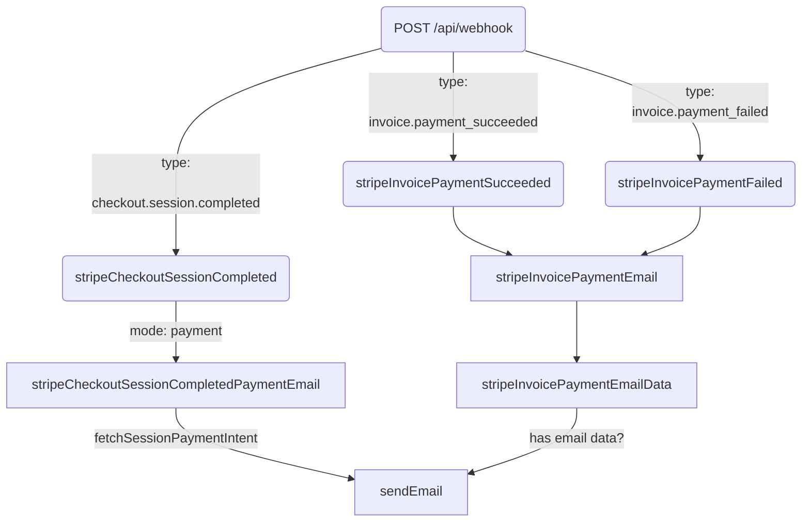
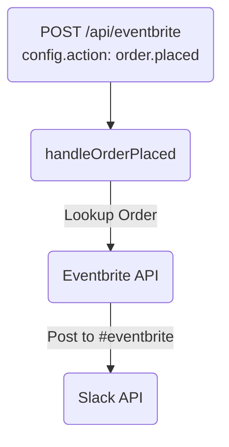

# Webhook Flowcharts

Synchronization of records through this donation portal is primarily one
direction.

## Givebutter

## Stripe

### Email Webhook

The /api/webhook endpoint is only responsible for sending emails

## Eventbrite

### Slack Order Notifications

Notifications of Eventbrite orders are directly posted to Slack

